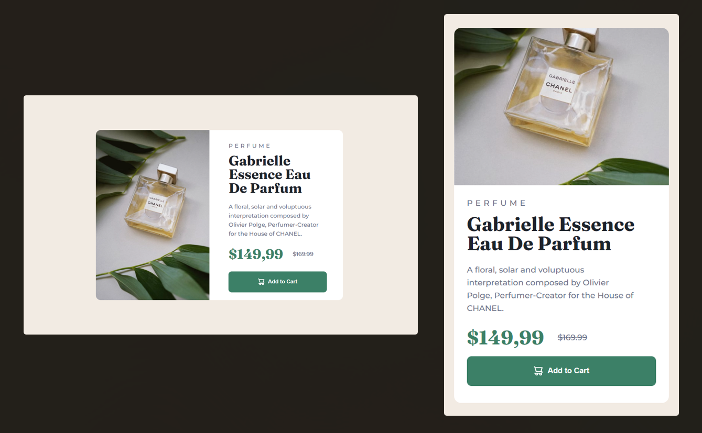

# Frontend Mentor - Product Card Preview

This is a solution to the [Product preview card component challenge on Frontend Mentor](https://www.frontendmentor.io/challenges/product-preview-card-component-GO7UmttRfa). Frontend Mentor challenges help you improve your coding skills by building realistic projects.

## Table of contents

- [Overview](#overview)
  - [The challenge](#the-challenge)
  - [Screenshot](#screenshot)
  - [Links](#links)
- [My process](#my-process)
  - [Built with](#built-with)
  - [What I learned](#what-i-learned)
- [Author](#author)

## Overview

### The challenge

Users should be able to:

- View the optimal layout depending on their device's screen size
- See hover and focus states for interactive elements

### Screenshot



### Links

- Solution URL: [FrontendMentor Profile](https://www.frontendmentor.io/solutions/product-card-preview-9pTwHyALJS)
- Live Site URL: [Vercel Deploy](https://product-card-preview-ashen.vercel.app/)

## My process

### Built with

- Semantic HTML5 markup
- CSS custom properties
- Flexbox
- Mobile-first workflow

### What I learned

Here I put into practice a little of my knowledge in FlexBox, choosing to develop from the mobile first concept, always aiming for a responsive layout. I used background-image to change image after breakpoint to large screen (code below).
I also tried to put the dimensions as close as possible to the design of the challenge, even though I don't have access to the Figma or Sketch file.

```html
<picture>
  <source
    media="(min-width:1024px )"
    srcset="./images/image-product-desktop.jpg"
  />
  
</picture>
```

## Author

- Website - [Portfolio](https://brunolima-portfolio.vercel.app/)
- Frontend Mentor - [@brunolyma](https://www.frontendmentor.io/profile/brunolyma)
